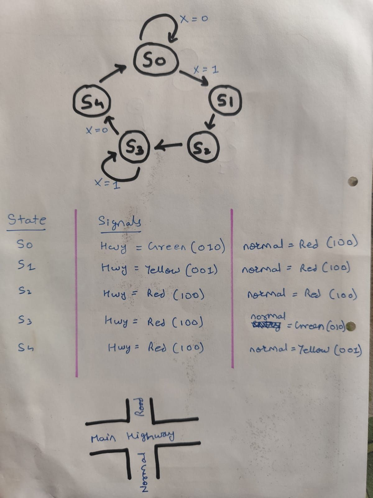
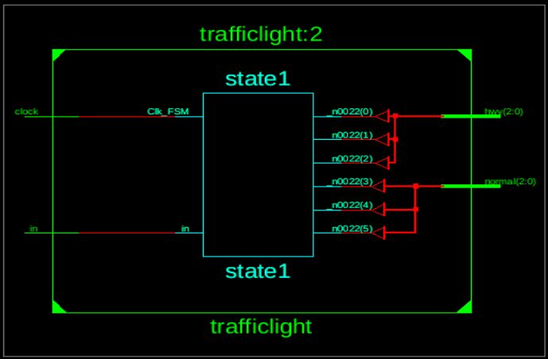
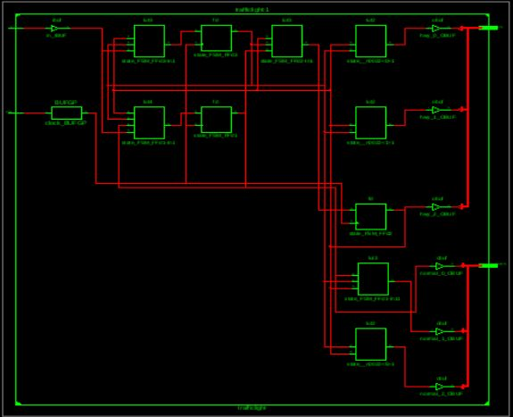
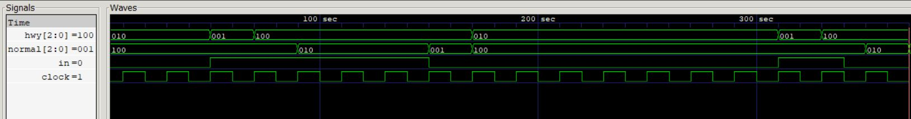
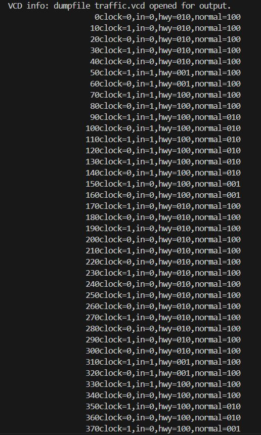
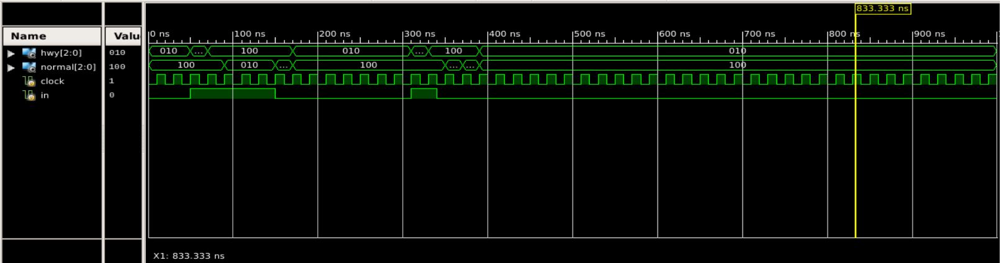

# 🚦 Traffic Light Controller in Verilog HDL


*Traffic Light State Visualization*

---

## Table of Contents

- [About](#about)
- [Features](#features)
- [Simulation & Waveforms](#simulation--waveforms)
- [References](#references)
- [How to Run](#how-to-run)
- [License](#license)
- [Contact](#contact)

---

## About

This project implements a **Traffic Light Controller** using a Finite State Machine (FSM) in Verilog HDL. It models realistic traffic control between a highway and a normal road, changing light states based on car detection and clock input.

- **Inputs:** Clock signal, car presence sensor (`in`)
- **Outputs:** Highway and normal road lights (red, yellow, green for each)
- **Design:** Five-state FSM with clear state transitions and outputs

---

## Features

- **FSM-Based Control:** Reliable and easily extensible for more roads or sensors
- **Realistic Timing:** Handles car arrivals/departures for smart traffic management
- **Clear Output Encoding:** Red, green, yellow for both highway and normal road
- **Synthesizable & Testable:** Ready for FPGA, ASIC, and simulation environments

---

## Simulation & Waveforms

**Traffic Light State Visualization:**  


**RTL Schematic:**  


**FSM Schematic:**  


**GTKWave Output:**  


**Icarus Verilog Testbench Result:**  


**Xilinx ISim Simulation:**  


---

## References

- [`traffic.v`](traffic.v) — Main traffic light FSM code
- [`testbench.v`](testbench.v) — Testbench for simulation
- **Academic Courses:**
  - [NPTEL: Digital Design (EE180)](https://onlinecourses.nptel.ac.in/noc25_ee180/preview)
  - [NPTEL: VLSI Design (CS155)](https://onlinecourses.nptel.ac.in/noc25_cs155/preview)
- **Research Papers:**
  - [Design and Implementation of Traffic Light Controller using Verilog](https://ieeexplore.ieee.org/document/10156804) *(good, FSM-based practical implementation)*
  - [FPGA-Based Traffic Light Controller](https://ieeexplore.ieee.org/document/10838078) *(suitable for real hardware systems)*

---

## How to Run

1. **Clone the Repository**
    ```sh
    git clone https://github.com/yourusername/traffic_light_verilog.git
    cd traffic_light_verilog
    ```

2. **Compile & Simulate**
    ```sh
   iverilog -o [testbench_name.vvp] [testbench_name.v]
   vvp [testbench_name.vvp]
    ```

3. **View Waveforms**
    ```sh
    gtkwave traffic.vcd
    ```

---

## License

This project is licensed under the [MIT License](LICENSE).

```
MIT License

Copyright (c) 2025 Tejas R Mallah

Permission is hereby granted, free of charge, to any person obtaining a copy of this software and associated documentation files (the "Software"), to deal in the Software without restriction, including without limitation the rights to use, copy, modify, merge, publish, distribute, sublicense, and/or sell copies of the Software, and to permit persons to whom the Software is furnished to do so, subject to the following conditions:

THE SOFTWARE IS PROVIDED "AS IS", WITHOUT WARRANTY OF ANY KIND, EXPRESS OR IMPLIED.
```

---

## Contact

- **LinkedIn:** [Tejas R Mallah](https://www.linkedin.com/posts/tejas-r-mallah-28052b283_verilog-digitaldesign-vlsi-activity-7365287507430719489-yYqz?utm_source=share&utm_medium=member_desktop&rcm=ACoAAET0mcABoSmVvowkUz7qcSZkG2bhRVZnDQ4)
- **Email:** tejasmallah@gmail.com

---

## Join the Conversation!

💡 _Always open to feedback, collaboration, and exciting roles in digital hardware, FPGA, and VLSI design!_

---
```
#Verilog #FPGA #DigitalDesign #TrafficLight #VLSI #FSM #RTL #Xilinx #IcarusVerilog #EDA #NPTEL #GTKWave
```
