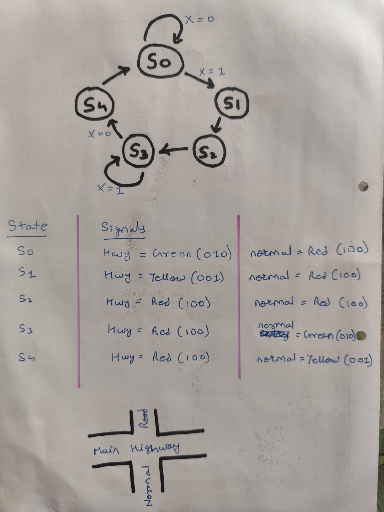
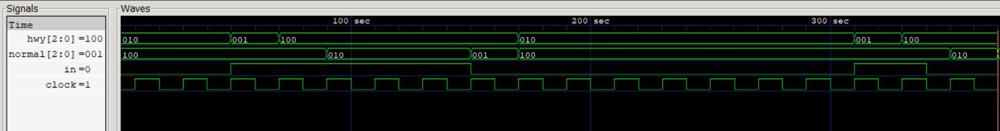
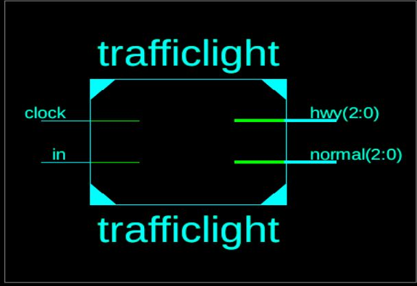
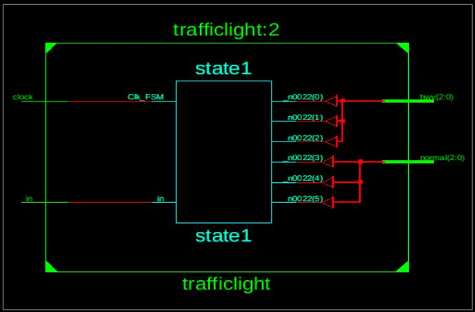
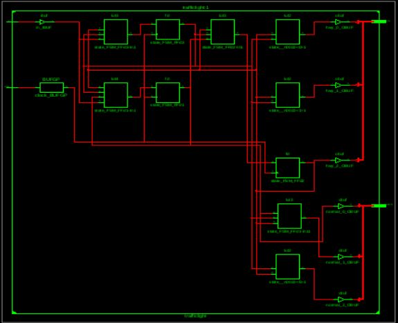
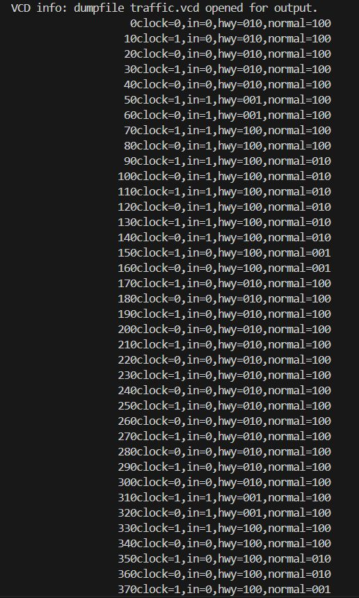
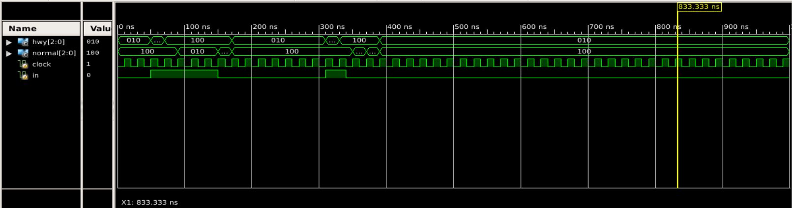

# 🚦 Traffic Light Controller in Verilog HDL

  
*Traffic Light State Visualization*

---

 

## Quick Summary

A 5-state Finite State Machine (FSM) based traffic controller for highway and main road, written in Verilog HDL. Simulates realistic signal switching using smart sensors and is verified on multiple EDA toolchains (Icarus, Xilinx ISim, GTKWave).

---

## Table of Contents

- [About](#about)
- [Features](#features)
- [Simulation Results](#simulation--results)
- [References](#references)
- [How to Run](#how-to-run)
- [Related Projects & Videos](#related-projects--videos)
- [License](#license)
- [Contact](#contact)

---

## About

Implements a **Traffic Light Controller** using FSM in Verilog HDL. Models traffic logic for a highway and side road, dynamically updating signal states when vehicles are detected.

- **Inputs:** Clock, car sensor (`in`)
- **Outputs:** Highway/road red, yellow, green signals
- **FSM:** Five states with robust, testable logic

---

## Features

- **FSM Control:** Modular, easy for future expansion.
- **Realistic Sensing:** Responds to dynamic traffic.
- **Synthesizable:** Suitable for FPGA/ASIC use.
- **Multi-tool Testbench:** Verified with Icarus, GTKWave, ISim.

---

## Simulation & Results

- All state transitions are fully validated.
- **Waveforms & Schematics:**  
    
    
    
    
    
    
  

  > The simulations confirm correct signal switching and state updates for all cases.

---

## References

- [`traffic.v`](traffic.v) — Main FSM module
- [`testbench.v`](testbench.v) — Testbench
- [NPTEL: Digital Design (EE180)](https://onlinecourses.nptel.ac.in/noc25_ee180/preview)  
- [Design & Implementation of Traffic Light Controller (paper)](https://ieeexplore.ieee.org/document/10156804)

---

## How to Run

1. **Clone Repo:**  
    ```sh
    git clone https://github.com/yourusername/traffic_light_verilog.git
    cd traffic_light_verilog
    ```
2. **Compile & Simulate (Icarus):**  
    ```sh
    iverilog -o traffic_test.vvp testbench.v traffic.v
    vvp traffic_test.vvp
    ```
3. **View Waveforms:**  
    ```sh
    gtkwave traffic.vcd
    ```
---

## Related Projects & Videos

- **Traffic Light Controller:**  
  [YouTube Demo](https://youtu.be/sOP0Q7eYFmA?si=7gRoLFyiltpx4Tni)
- **Full Adder:**  
  [YouTube Demo](https://youtube.com/shorts/YUpM37PON2s?feature=shared)
- **Half Subtractor:**  
  [YouTube Demo](https://youtube.com/shorts/OssNW_W3E6k?si=Qf98I_jwUKjFF4Ek)
- *(See my profile for more Verilog HDL designs!)*

---

## License

Licensed under the [MIT License](LICENSE).

---

## Contact

- **LinkedIn:** [Tejas R Mallah](https://www.linkedin.com/posts/tejas-r-mallah-28052b283_verilog-digitaldesign-vlsi-activity-7365287507430719489-yYqz?utm_source=share&utm_medium=member_desktop&rcm=ACoAAET0mcABoSmVvowkUz7qcSZkG2bhRVZnDQ4)
- **Email:** tejasmallah@gmail.com

---

#### 💡 _Let’s connect! I’m passionate about digital hardware, VLSI, and system design projects._

---

<!--
#Verilog #FPGA #DigitalDesign #TrafficLight #VLSI #FSM #RTL #Xilinx #IcarusVerilog #EDA #NPTEL #GTKWave
-->
